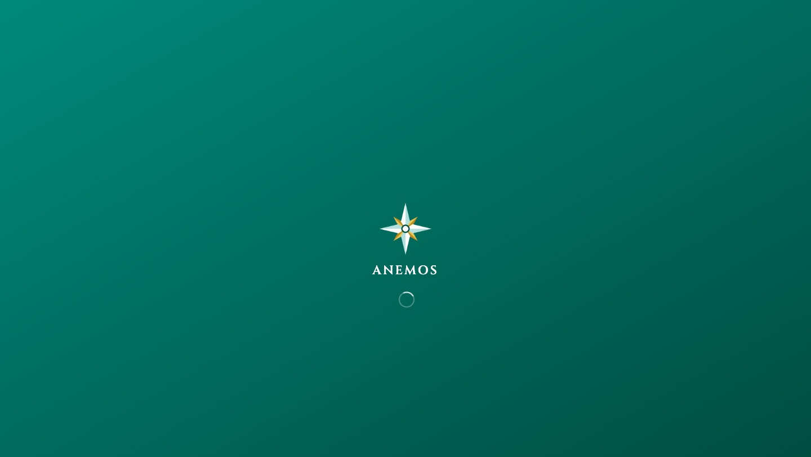
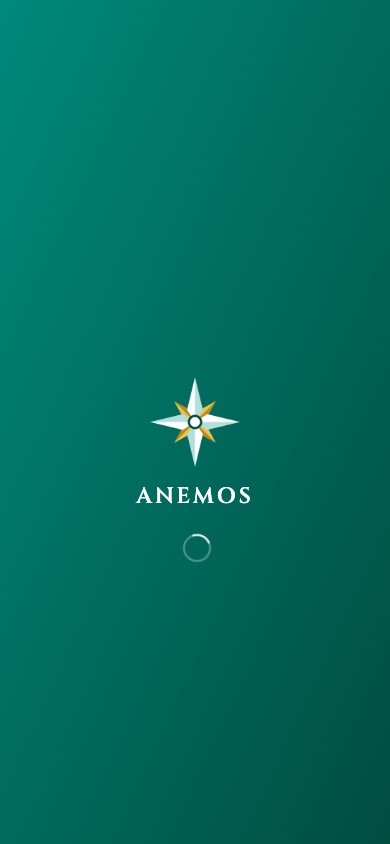
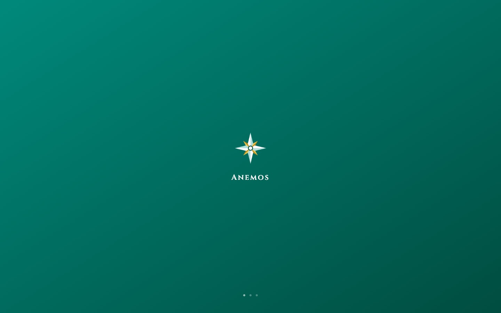

# Spec: Splash screen redesign

> **WHAT & WHY only.** Tech decisions live in `plan.md`.

## Context

The boot splash is the first thing anyone sees, and nobody — including the
owner — had ever seen it at rest: it flashes past on a fast load and only
sits still on slow cold starts, exactly the loads where it matters most.
Captured at rest for the first time (screenshots below), it showed an
on-brand field with two problems: a Material progress ring — the one
generic-default element on the screen, reading at rest as a dim smudge
crowding the wordmark — and a composition that hangs low, because the mark
sits at exact viewport centre with everything else stacked beneath it.

A Mobbin sweep of premium travel splashes (Marriott Bonvoy, Qantas, Viator,
Booking.com, Singapore Airlines) is unanimous: brand lockup at optical
centre, no spinner, and — where any loading signal exists at all — the
quietest possible one, parked away from the brand moment. That is also the
register of the design system's own references (Belmond's wordmark floating
on a pool-teal field; Aman's emptiness-as-luxury).

## User Stories

- As a **traveler on a fast connection**, I want the boot flash to read as a
  composed brand still, not a spinner caught mid-frame.
- As a **traveler on a slow cold start**, I want the screen to read as
  deliberately alive — designed waiting, not a hung app.
- As a **motion-sensitive traveler**, I want the splash to go still when my
  system asks for reduced motion.
- As a **screen-reader user**, I want the loading state spoken, not implied
  by a decorative animation.

## Acceptance Criteria

- [x] The mark + wordmark lockup reads optically centred as one unit, on the
      sanctioned brand gradient, at desktop and phone widths.
- [x] No Material spinner anywhere; the loading signal is three tiny
      breathing dots parked at the bottom edge, staggered on the same 1.8s
      rhythm as the existing mark pulse.
- [x] The static HTML boot splash (web/index.html) and the Flutter splash
      stay pixel-matched, including the wordmark's small-caps letterforms —
      the handoff reads as one continuous screen.
- [x] `prefers-reduced-motion` stills every animation on both sides.
- [x] The dots carry a localized semantic label (`splashLoading`); the
      wordmark is not announced twice.
- [x] No artificial delay: the design degrades well at both ~200ms and ~5s
      naturally.

## Before / after

| | Desktop | Mobile |
|---|---|---|
| Before |  |  |
| After |  |  |
